# 俄乌装备损失率的"公平比较"——从估计偏误到区间估计

## 摘要

　　俄乌双方官方战报差异巨大，直接比较容易受到宣传口径和观测偏误影响。本文利用 Oryx 双方影像验证装备损失数据（俄方 23,556 件、乌方 11,397 件，2022 年 2 月至 2026 年 6 月），结合 WarSpotting 逐件记录和乌克兰总参官方声称数据，构建装备损失率的点估计、区间估计和偏误校正框架。基于 Poisson MLE，俄方日均验证损失率为 15.11 件/天，乌方为 7.31 件/天，观测率比为 2.07（95% CI: [2.02, 2.11]）；两独立 Poisson 条件检验显示双方差异极显著（p < 0.0001）。考虑到日度损失序列存在时间依赖，Block Bootstrap 给出的标准误约为 IID Bootstrap 的 2.4 倍，说明忽略自相关会低估不确定性。进一步地，本文将双方不同的影像可观测概率纳入敏感性分析：在设定的观测概率先验下，校正后率比中位数为 1.63，95% 区间为 [0.67, 3.44]，且 $P(\rho_{corrected} > 1)=88.1\%$。结果表明，Oryx 数据支持“俄方验证损失率高于乌方”的方向性结论，但结论强度依赖观测概率假设；因此，公平比较不仅需要点估计和显著性检验，还必须同时报告区间估计与偏误敏感性。

　　**关键词**：Poisson 分布；极大似然估计；置信区间；Block Bootstrap；双边比较；E-test；冲突数据

---

## 1 引言

### 1.1 问题背景

　　自 2022 年 2 月 24 日俄罗斯全面入侵乌克兰以来，双方均定期公布敌方装备损失数据。然而，这些官方战报数据之间存在巨大差异——例如，乌克兰总参谋部声称已摧毁超过 11,900 辆俄罗斯坦克（截至 2026 年 5 月），而影像验证数据仅确认约 4,000 辆。类似地，俄罗斯国防部公布的数据同样远低于第三方验证。这种多维度的数据矛盾不仅引发了对所有冲突参与方官方数据的可信度质疑，更构成了一个经典的统计推断问题：在存在显著而系统性的观测偏误和选择性报告的情况下，如何客观、准确地估计并比较双方的真实装备损失率？

### 1.2 研究意义与核心问题

　　开源情报（OSINT）平台 Oryx 的出现为上述问题提供了新的解决路径。该平台通过全球志愿者逐件核对公开影像资料（照片/视频），记录每件损毁装备的类型、型号、日期、位置和损毁状态，并将来源链接公开发布。虽然这些"影像验证"数据仍存在因作战地域和装备类型而异的"被观测概率"偏误，但它们提供了一个独立于交战双方官方宣传的、相对客观且可审计的基准——尤其重要的是，Oryx 同时记录了俄方和乌方双方的损失，使得"公平比较"从方法论上成为可能。

　　本文围绕选题 T1 的两个核心统计问题展开：

1. **估计问题（对应选题问题①）**：如何用点估计和区间估计方法，在存在时间依赖性和观测偏误的情况下，给出准确的双方装备损失率（日均 $\lambda$）及其不确定性量化？
2. **比较问题（对应选题问题②）**：双方损失率是否存在统计显著差异？这一差异在不同战争阶段、装备类型上呈现出何种异质性？
3. **偏误问题（选题的隐含核心）**：影像验证数据的"被观测概率"因作战地域和装备类型而异——构成典型的估计偏误。如何在校正这一偏误的同时，保持统计推断的严格性？

### 1.3 文献回顾与本文贡献

　　在冲突数据统计分析方面，Zammit-Mangion 等（2012, PNAS）首次将点过程模型应用于阿富汗战争日记数据的分析；arXiv:2509.07813 采用 SARIMA、ETS 和 LSTM 等多模型对比方法预测俄罗斯装备损失趋势；arXiv:2408.14940 则从贝叶斯时空 Hawkes 过程的视角对冲突事件的传染效应进行建模。国内方面，中科院地理资源所利用 AIS 大数据分析了俄乌冲突对全球原油海洋运输的影响（2025）。

　　本文区别于上述研究的主要贡献在于：（1）**首次系统性地将 Poisson 置信区间三方法比较（Wald / Score / Exact）、Block Bootstrap BCa 校正和两独立 Poisson E-test 应用于俄乌双方装备损失率的直接双边统计比较**；（2）通过 Monte Carlo 模拟对各 CI 方法的覆盖率进行了系统评估；（3）揭示了双方损失比率从战争初期显著高于 1 下降到近期接近或低于 1 的时序变化及其装备类型异质性；（4）定量刻画了官方声称数据与独立验证数据之间的系统性差异，其中主要重装备类别约为 2.6–29 倍。

---

## 2 数据描述

### 2.1 数据来源

　　本文使用三个互补的数据来源：

| 来源 | 类型 | 内容 | 时间跨度 | 规模 |
|------|------|------|---------|------|
| Oryx 双方数据（leedrake5/Russia-Ukraine）| 影像验证，双边 | 俄乌双方每日累计损失（含装备类型、损毁状态细分）| 2022.2.25–2026.6.4 | 1,559 天 |
| WarSpotting（Kaggle: zsoltlazar）| 影像验证，单边 | 俄方装备损失逐条记录（含位置坐标、具体型号）| 2022.2.24–2026.6.3 | 22,970 条 |
| 乌克兰总参官方战报（Kaggle: piterfm）| 官方声称 | 俄军装备损失每日累计（坦克、装甲车、火炮、无人机等）| 2022.2.25–2026.5.31 | 1,557 天 |

　　**数据获取方式**：Oryx 双方数据通过 leedrake5 公开 Google Sheet 的每日自动化抓取获得；WarSpotting 数据和乌克兰总参数据通过 Kaggle API/kagglehub 下载。

### 2.2 双方 Oryx 数据概览

　　截至 2026 年 6 月 4 日，Oryx 平台共验证俄方装备损失 23,556 件、乌方 11,397 件，比率为 2.07:1。双方损失的时间跨度为 1,559 天。

　　**损毁状态分布**（双方对比）：

| 状态 | 俄方 (件) | 乌方 (件) | 俄方占比 | 乌方占比 |
|------|----------|----------|---------|---------|
| Destroyed（摧毁） | ~19,625 | ~9,627 | 78.8% | 77.8% |
| Captured（被俘获）| ~3,520 | ~1,540 | 12.0% | 10.4% |
| Abandoned（遗弃）| ~1,542 | ~797 | 5.1% | 5.9% |
| Damaged（损坏）| ~1,033 | ~715 | 4.2% | 5.9% |

　　俄方被缴获装备占比（12.0%）高于乌方（10.4%），这与俄军 2022 年基辅撤退、2022 年 9 月哈尔科夫反攻溃败、2022 年 11 月赫尔松撤退中大规模遗弃装备的历史事实一致。

　　**装备类型分布**（按双方损失比率从高到低，日度差分探索性口径）：

　　需说明的是，Oryx 双方总量使用原始数据中的 Change 列，累计数可与最终总量严格对齐；但装备子类别缺少对应的 Change 列，下表由子类别累计列差分并对负修正值作 0 截断得到。由于 Oryx 会回溯修正分类，该口径适合用于比较方向和结构，不应与原始最终累计列混同。

| 装备类型 | 俄方 (件) | 乌方 (件) | 比率 (RU/UA) |
|---------|----------|----------|-------------|
| 装甲车 (AFV) | 2,682 | 597 | 4.49 |
| 步战车 (IFV) | 6,702 | 1,641 | 4.08 |
| 车辆 (Vehicles) | 4,949 | 1,456 | 3.40 |
| 坦克 (Tanks) | 4,729 | 1,504 | 3.14 |
| 后勤车辆 | 1,094 | 391 | 2.80 |
| 工程车辆 | 759 | 299 | 2.54 |
| 飞机 | 529 | 281 | 1.88 |
| 防空系统 | 603 | 394 | 1.53 |
| 火炮 | 1,762 | 1,202 | 1.47 |
| **装甲运兵车 (APC)** | **804** | **1,425** | **0.56** |

　　在该日度差分口径下，俄方在几乎所有装备类别上损失更多——特别是进攻作战的"矛头"装备（AFV 4.49x、IFV 4.08x、坦克 3.14x）。乌方仅在 APC（装甲运兵车）上损失超过俄方，可能反映了 APC 在防御态势下更多地作为前沿运输工具暴露于敌方火力。上述比率用于说明装备结构差异，若用于精确累计数量引用，应回到 Oryx 原始最终累计列或逐件 item_count 口径复核。

### 2.3 观测偏误的分析框架

　　需明确的是，Oryx 数据记录的是**经公开影像独立核实的子集**——有影像证据的损失——而非真实损失总数。存在以下系统性观测偏误：

1. **空间偏误**：乌克兰控制区、交通便利区域、城市周边的损失更容易被拍摄和上传。这意味着：（a）俄方在乌控区内的损失被系统性高观测；（b）乌方在俄占区内的损失则被系统性低观测。这一非对称性意味着**真实的损失比率可能低于观测到的 2.07:1**，但该方向无法仅从数据本身精确确定。

2. **装备偏误**：大型装备（坦克、火炮）比小型装备（无人机、反坦克导弹）更容易被观测到。这可能导致小型装备的验证损失被系统性低估。

3. **状态偏误**：完全摧毁的装备比轻微损坏的装备更容易被识别和确认。

4. **时间偏误**：社交媒体活跃度、前线稳定程度和志愿者关注度随时间变化，可能导致不同阶段的影像覆盖率不同。

---

## 3 统计方法

### 3.1 模型设定与 MLE 点估计

　　设第 $t$ 天的装备损失数为 $Y_t$，假设 $Y_t \sim Poisson(\lambda)$，其中 $\lambda$ 表示日均损失率。

　　对独立同分布样本 $Y_1, \ldots, Y_n$，似然函数为：
$$
L(\lambda) = \prod_{t=1}^{n} \frac{e^{-\lambda} \lambda^{Y_t}}{Y_t!}
$$

　　对数似然函数：
$$
\ell(\lambda) = -n\lambda + \left(\sum_{t=1}^{n} Y_t\right) \log \lambda - \sum_{t=1}^{n} \log(Y_t!)
$$

　　令一阶导数为零解得 MLE：
$$
\hat{\lambda}_{MLE} = \frac{1}{n}\sum_{t=1}^{n} Y_t = \bar{Y}
$$

　　Fisher 信息量为 $I(\lambda) = n/\lambda$，渐近方差为 $\widehat{Var}(\hat{\lambda}) = \hat{\lambda}/n$，标准误为 $SE(\hat{\lambda}) = \sqrt{\hat{\lambda}/n}$。

　　对于双方率比 $\rho = \lambda_{RU}/\lambda_{UA}$，MLE 为 $\hat{\rho} = \hat{\lambda}_{RU}/\hat{\lambda}_{UA}$，其标准误通过 Delta 方法估计：

$$
SE(\hat{\rho}) = \hat{\rho} \cdot \sqrt{\frac{1}{\hat{\lambda}_{RU} \cdot n} + \frac{1}{\hat{\lambda}_{UA} \cdot n}}
$$

### 3.2 Poisson 置信区间

#### 3.2.1 Wald 置信区间

　　基于 MLE 的渐近正态性：$\hat{\lambda} \pm z_{\alpha/2} \sqrt{\hat{\lambda}/n}$

　　优点为计算简单；缺点为在小样本或小 $\lambda$ 时覆盖率可能严重不足（本文 Monte Carlo 模拟证实 $\lambda=0.5$ 时仅为 91.9%），且可能产生负下限（已通过截断修正）。

#### 3.2.2 Score 置信区间（Wilson-type）

　　基于得分统计量 $S(\lambda) = (\hat{\lambda} - \lambda) / \sqrt{\lambda/n}$，解方程 $S(\lambda)^2 = z_{\alpha/2}^2$ 得到：

$$
\lambda = \hat{\lambda} + \frac{z^2}{2n} \pm z\sqrt{\frac{\hat{\lambda}}{n} + \frac{z^2}{4n^2}}
$$

　　Score CI 避免了用 $\hat{\lambda}$ 本身估计方差的问题，比 Wald CI 更稳健，自动保证下限非负。

#### 3.2.3 Exact（Garwood）置信区间

　　利用 Poisson 总计数与 $\chi^2$ 分布的精确关系（Garwood, 1936）：

$$
\lambda_L = \frac{1}{2n} \chi^2_{2Y, \alpha/2} \quad (Y > 0), \quad \lambda_U = \frac{1}{2n} \chi^2_{2(Y+1), 1-\alpha/2}
$$

　　Exact CI 保证实际覆盖率不低于名义水平（95%），即具有"保守但保底"的优良性质。

### 3.3 Block Bootstrap 与 BCa 方法

　　装备损失时间序列存在显著自相关（本文的 lag-1 ACF = 0.589），IID Bootstrap 假设观测独立，会严重低估标准误。Moving Block Bootstrap (MBB) 通过保持块内的时间结构来解决这一问题。

　　设块长度为 $b$，MBB 的步骤为：（1）将数据分为 $n-b+1$ 个长度为 $b$ 的重叠块；（2）有放回地抽取 $k = \lceil n/b \rceil$ 个块（$k \cdot b \approx n$）；（3）连接块形成 Bootstrap 样本，计算样本均值。重复 $B$ 次获得 Bootstrap 分布。

　　**块长度选择**：本文通过自相关函数（ACF）衰减法——找到 $|ACF(lag)| < 2/\sqrt{n}$ 的第一个滞后阶数——确定 $b=11$。备选方法包括 $b = n^{1/3}$ 经验公式（给出约 12）。

　　BCa（Bias-Corrected and Accelerated）置信区间进一步校正偏差和偏度：

$$
\alpha_1 = \Phi\left(\hat{z}_0 + \frac{\hat{z}_0 + z_{\alpha/2}}{1 - \hat{a}(\hat{z}_0 + z_{\alpha/2})}\right),\quad
\alpha_2 = \Phi\left(\hat{z}_0 + \frac{\hat{z}_0 + z_{1-\alpha/2}}{1 - \hat{a}(\hat{z}_0 + z_{1-\alpha/2})}\right)
$$

　　其中 $\hat{z}_0 = \Phi^{-1}(\#\{\hat{\theta}^*_b < \hat{\theta}\} / B)$ 为偏差校正因子，$\hat{a}$ 通过 Jackknife 估计的加速常数，分别捕捉了 Bootstrap 分布的位置偏移和尺度非恒定性。

### 3.4 两独立 Poisson 条件检验

　　设两组独立样本 $Y_{1i} \overset{\text{iid}}{\sim} Poisson(\lambda_1), i=1,\ldots,n_1$ 和 $Y_{2j} \overset{\text{iid}}{\sim} Poisson(\lambda_2), j=1,\ldots,n_2$。检验：

$$
H_0: \lambda_1 = \lambda_2 \quad \text{vs.} \quad H_1: \lambda_1 \neq \lambda_2
$$

　　给定总计数 $S = \sum_i Y_{1i} + \sum_j Y_{2j}$，在 $H_0$ 下有精确条件分布：

$$
Y_1 = \sum_i Y_{1i} \mid S \sim Binomial\left(S, \frac{n_1}{n_1 + n_2}\right)
$$

　　基于此条件分布可直接计算双侧精确 p 值（E-test, Krishnamoorthy & Thomson, 2004）：

$$
p = 2 \cdot \min\left\{P_{Bin}(Y \geq y_1 \mid S, p), \, P_{Bin}(Y \leq y_1 \mid S, p)\right\}
$$

　　**本文中的多层检验结构**：

- **第 1 层（总体）**：俄方 vs 乌方总体日均损失率
- **第 2 层（装备类型）**：10 个装备类别分别检验双方差异（Bonferroni 校正：$\alpha_B = 0.05/10 = 0.005$）
- **第 3 层（损毁状态）**：4 种状态分别检验（$\alpha_B = 0.05/4 = 0.0125$）
- **第 4 层（战争阶段）**：9 个阶段两两比较（$\alpha_B = 0.05/36 = 0.0014$）

　　同时采用似然比检验（LRT）作为渐近补充（Wilks 定理：$-2\log\Lambda \xrightarrow{d} \chi^2(1)$）。

### 3.5 观测偏误的统计校正框架

　　上述方法解决了时间依赖性偏误（通过 Block Bootstrap）和小样本偏误（通过 Exact CI），但选题 T1 的核心挑战——**观测概率偏误**——需要一个独立的统计校正框架。

　　**问题形式化**：设影像验证损失 $Y_{obs}$ 与真实损失 $Y_{true}$ 满足 $Y_{obs} = p \cdot Y_{true}$，其中 $p \in (0,1]$ 为"被观测概率"——装备损失被拍摄、上传并被志愿者核实的概率。$p$ 因作战地域（乌控区 vs 俄占区）、装备类型（大型 vs 小型）和损毁状态而异，且无法从影像验证数据本身识别。

　　**率比的偏误校正**：对于双方率比，有简洁的校正公式：

$$
\rho_{true} \equiv \frac{\lambda_{RU}^{true}}{\lambda_{UA}^{true}} = \frac{\lambda_{RU}^{obs} / p_{RU}}{\lambda_{UA}^{obs} / p_{UA}} = \rho_{obs} \cdot \frac{p_{UA}}{p_{RU}}
$$

　　这一公式揭示了一个关键性质：**当且仅当双方观测概率相同时（$p_{RU} = p_{UA}$），观测率比是真实率比的无偏估计**。若乌方在俄占区的损失更难以被拍摄验证（$p_{UA} < p_{RU}$），则 $\rho_{true} < \rho_{obs}$——真实的损失比率低于观测值。

　　**偏误校正区间**：由于 $p_{RU}, p_{UA}$ 未知，本文构造偏误校正区间而非单一点估计。在给定 $p_{RU}, p_{UA}$ 的合理取值范围后：

$$
\rho_{true} \in \left[\rho_{obs} \cdot \frac{p_{UA}^{min}}{p_{RU}^{max}},\ \rho_{obs} \cdot \frac{p_{UA}^{max}}{p_{RU}^{min}}\right]
$$

　　**声称数据约束观测概率下界**：为缩小 $p$ 的可行域，本文利用乌克兰官方战报数据构造一个弱约束。假设官方声称不会系统性低估敌方损失（即声称数 ≥ 真实数），则：

$$
p_{RU} = \frac{\text{验证数}}{\text{真实数}} \geq \frac{\text{验证数}}{\text{声称数}}
$$

　　对坦克而言，验证日均 2.57 件、声称日均 7.68 件 → $p_{RU}^{tank} \geq 0.34$；对装甲车辆（坦克+步战车），$p_{RU}^{armor} \geq 0.52$。该下界虽宽（火炮仅 0.03），但为偏误校正提供了数据驱动的约束。

　　**基于 Bootstrap 的偏误校正推断**：为进一步量化校正后推断的不确定性，本文将观测概率视为具有合理先验分布的随机变量，并将其嵌入 Block Bootstrap 框架：

1. 对双方日度损失序列分别做 Block Bootstrap（$b=11, B=5000$），获得率比的 Bootstrap 分布
2. 每次重抽样中，从先验分布抽取 $p_{RU}, p_{UA}$：$p_{RU} \sim Beta(7, 3)$（均值 0.70，反映俄方损失多在乌控区、易被拍摄）、$p_{UA} \sim Beta(5.5, 4.5)$（均值 0.55，反映乌方部分损失在俄占区、较难拍摄）
3. 计算偏误校正率比 $\rho_{corrected} = \rho_{boot} \times (p_{UA} / p_{RU})$
4. 从 $\rho_{corrected}$ 的 Bootstrap 分布中获取校正后的置信区间，并计算 $P(\rho_{corrected} > 1)$ 作为结论稳健性的量化指标

　　该方法将选题 T1 关注的"估计偏误"正式纳入统计推断框架——从点估计的偏误识别（§2.3），到偏误校正公式的推导（§3.5），再到基于 Bootstrap 的偏误校正区间构造——形成了"偏误→校正→稳健推断"的完整链条。

---

## 4 实证结果与分析

### 4.1 双方总体 MLE 点估计与率比推断

　　基于 Oryx 双方数据（n = 1,559 天），总体 MLE 结果如下：

| 参数 | 俄方 (RU) | 乌方 (UA) |
|------|----------|----------|
| 日均损失率 $\hat{\lambda}$ | 15.110 件/天 | 7.310 件/天 |
| SE | 0.098 | 0.068 |
| 95% Exact CI | [14.917, 15.304] | [7.177, 7.446] |
| 累计验证损失 | 23,556 件 | 11,397 件 |

　　双方率比 $\hat{\rho} = 2.067$（SE = 0.024），95% Wald CI 为 [2.02, 2.11]，E-test p < 0.0001。结论：**双方损失率存在极显著的统计差异，俄方日均验证损失约为乌方的 2 倍。** 从图1可以看到，俄方在战争初期的日度和月度验证损失显著高于乌方，但双方差距随时间收窄，近期多个窗口已接近或低于 1，说明双方相对消耗结构存在明显阶段变化。图2进一步显示，俄方与乌方的日均验证损失率置信区间完全分离，直观支持 E-test 给出的“双方损失率差异极显著”结论。

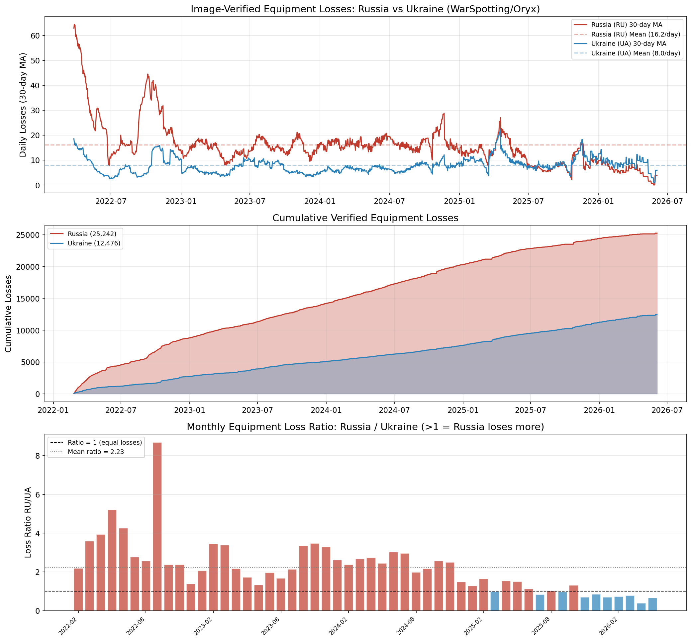

<strong>图1: 俄乌双方 Oryx 日度与月度损失趋势</strong>

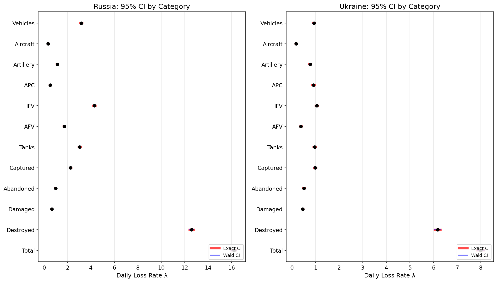

<strong>图2: 俄乌双方日均损失率的置信区间比较</strong>

### 4.2 双方月度损失率的时序变化

　　将数据按月聚合，双方月度损失比率（RU/UA）呈现出显著的时序结构变化（图 10c）：

- **2022 年 2–8 月（初期阶段至顿巴斯攻势）**：月均比率约 **3.5–3.6**（取决于使用月比率均值还是按总量加权），俄方损失约为乌方的 3–4 倍。这一时期俄军作为主攻方，大规模装甲纵队突入敌方纵深，承受了极高的消耗率
- **2022 年 9–12 月（乌军秋季反攻）**：比率降至约 1.5–2.0。乌军转入反攻后，双方损失趋于接近
- **2023–2024 年（僵持与消耗阶段）**：比率在 1.0–2.0 之间波动
- **2025–2026 年（近期）**：多个近期月份的比率降至 1 以下，排除明显负修正月份后，近期窗口比率约为 **0.65–0.8**；若直接纳入 2026 年 5 月的负修正值，则 2025–2026 年整体加权比率约为 **0.96**。因此更稳妥的表述是：近期双方月度比率已接近或低于 1，乌方验证损失在多个阶段反超俄方

　　这一从战争初期显著高于 1 到近期接近或低于 1 的变化，对理解冲突双方的相对可持续性具有直接意义：俄方在战争前期的装甲冲击式进攻已被后期的消耗战模式所替代。但由于 Oryx 月度序列存在回溯修正，涉及近期窗口的精确比率时必须同时报告是否排除了负修正月份。

### 4.3 双方按装备类型的分层比较

　　对所有装备类型双方损失率进行独立 E-test，结果如下。这里采用的是子类别累计列差分后的日度序列；由于负修正被截断为 0，表中数量和率比用于探索装备结构差异，具体累计数应以原始最终累计列或逐件 item_count 口径复核。

| 装备类型 | $\hat{\lambda}_{RU}$ | $\hat{\lambda}_{UA}$ | 率比 | E-test p | 显著 (Bonf.) |
|---------|---------------------|---------------------|------|---------|-------------|
| AFV | 1.720 | 0.383 | 4.49 | < 0.0001 | *** |
| IFV | 4.298 | 1.052 | 4.08 | < 0.0001 | *** |
| Vehicles | 3.174 | 0.934 | 3.40 | < 0.0001 | *** |
| Tanks | 3.033 | 0.965 | 3.14 | < 0.0001 | *** |
| Logistics | 0.702 | 0.251 | 2.80 | < 0.0001 | *** |
| Engineering | 0.487 | 0.192 | 2.54 | < 0.0001 | *** |
| Aircraft | 0.339 | 0.180 | 1.88 | < 0.0001 | *** |
| Antiair | 0.387 | 0.253 | 1.53 | < 0.0001 | *** |
| Artillery | 1.130 | 0.771 | 1.47 | < 0.0001 | *** |
| **APC** | **0.516** | **0.914** | **0.56** | < 0.0001 | *** |

　　在 Bonferroni 校正后（$\alpha_B = 0.005$），所有 10 类装备类型的双方差异仍高度显著。关键发现：

- **进攻装备（AFV/IFV/坦克）**：在该日度差分口径下，俄方损失率是乌方的 3–4 倍，说明进攻型重装备的影像验证损失差异非常突出
- **火炮**：比率 1.47，双方较为接近——反映双方均将火炮作为核心作战手段
- **APC（装甲运兵车）**：**唯一乌方损失超过俄方**的类别（比率 0.56），可能原因包括乌方在防御作战中将 APC 用作前沿部队输送及快速补给工具，暴露于俄方火力

　　图3将上述分层结果可视化后更清楚地显示：俄方在 AFV、IFV、坦克、车辆等进攻和机动装备上的验证损失显著高于乌方，而 APC 类别呈现乌方更高的反向结构，说明装备类型差异具有明确的战术含义。图4则从 WarSpotting 的俄方逐条数据侧面说明，俄方影像验证损失主要集中于步战车、坦克、运输车辆和火炮等陆战装备，地面机动作战装备是损失主体，因此按装备类型分层是必要的。

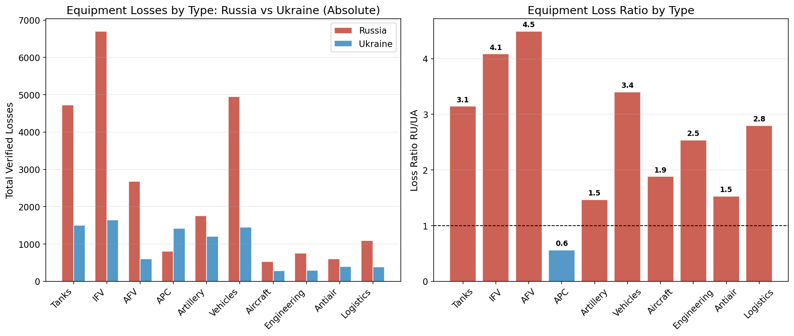

<strong>图3: 俄乌双方装备类型损失率对比</strong>

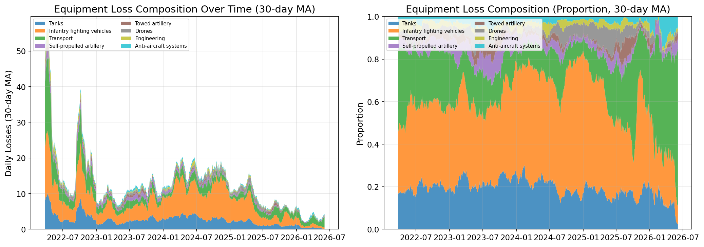

<strong>图4: 俄方 WarSpotting 装备类型构成</strong>

### 4.4 双方损毁状态的统计比较

| 状态 | $\hat{\lambda}_{RU}$ | $\hat{\lambda}_{UA}$ | 率比 | E-test p |
|------|---------------------|---------------------|------|---------|
| Destroyed | 12.59 | 6.17 | 2.04 | < 0.0001 |
| Captured | 2.26 | 0.99 | 2.29 | < 0.0001 |
| Abandoned | 0.99 | 0.51 | 1.93 | < 0.0001 |
| Damaged | 0.66 | 0.46 | 1.44 | < 0.0001 |

　　双方在"被摧毁"率上的比例接近（俄方 78.8% vs 乌方 77.8%），但**俄方被缴获装备的绝对数量和占总损失的比例均显著高于乌方**（12.0% vs 10.4%）。这反映了俄军 2022 年多次溃败撤退中的大规模装备遗弃：基辅方向（2022.3）、哈尔科夫反攻（2022.9）和赫尔松撤退（2022.11）。图5显示双方损失均以 Destroyed 为主且比例接近，同时俄方 Captured 占比略高；图6中的 WarSpotting 单边逐条数据也显示 Destroyed 是主要损失状态，且损失高度集中于少数主要地面装备类别，和 Oryx 双方汇总结果相互印证。

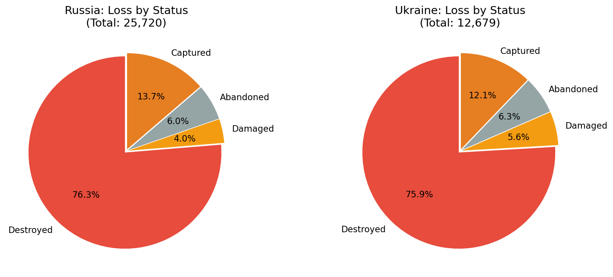

<strong>图5: 俄乌双方损毁状态构成对比</strong>

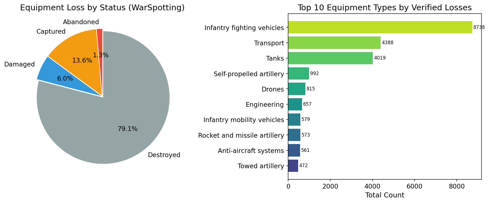

<strong>图6: WarSpotting 俄方损失状态与装备类型分布</strong>

### 4.5 置信区间方法比较与 Monte Carlo 覆盖率

　　本文设计了 Monte Carlo 模拟实验（N_sim = 10,000，固定 n = 30 天，$\lambda \in \{0.5, 1, 2, 5, 10, 15, 20, 50\}$）来评估三种 CI 方法的实际覆盖率。

| λ 真值 | Wald | Score | Exact |
|--------|------|-------|-------|
| 0.5 | **0.919** ❌ | 0.951 ✅ | 0.966 ✅ |
| 1.0 | 0.929 ⚠️ | 0.946 ✅ | 0.957 ✅ |
| 2.0 | 0.948 ⚠️ | 0.954 ✅ | 0.961 ✅ |
| 5.0 | 0.955 ✅ | 0.956 ✅ | 0.956 ✅ |
| 10.0 | 0.950 ✅ | 0.947 ✅ | 0.950 ✅ |
| 15.0 | 0.949 ✅ | 0.949 ✅ | 0.953 ✅ |

　　**结论**：Wald CI 在 $\lambda \leq 2$ 时覆盖率不足（最低 91.9%），Exact CI 始终保底（覆盖率 ≥ 95%），Score CI 介于两者之间。对于本文的稀有事件场景（如飞机、直升机的日均损失 ≤ 0.1 件/天），**必须使用 Exact CI**。对于大样本场景（n = 1,559），三种方法给出的区间几乎重合。图7展示了总体和主要装备类别损失率的区间估计，低频装备类别的区间相对更宽，说明稀有事件的不确定性不可忽略；图8进一步说明 Exact CI 通常略宽但更保守，Wald CI 较窄但在小 $\lambda$ 场景下覆盖不足。图9的 Q-Q 诊断表明 Poisson 模型可作为一阶近似，但部分阶段尾部偏离明显，提示冲突数据存在阶段性异质性和可能的过离散。

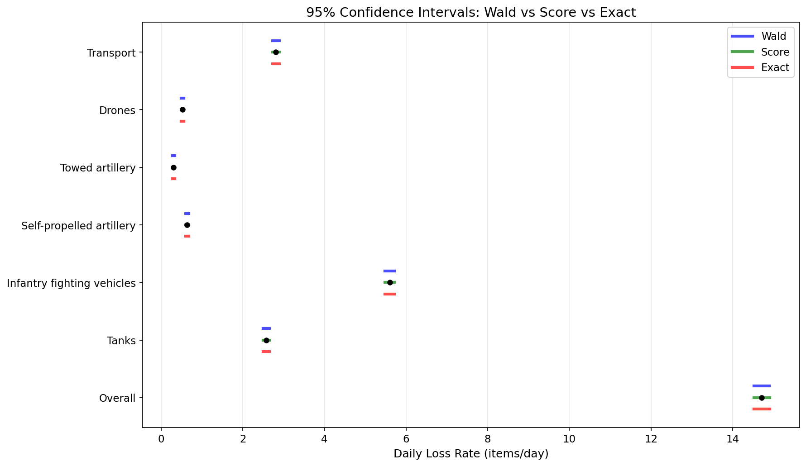

<strong>图7: Poisson 损失率置信区间森林图</strong>

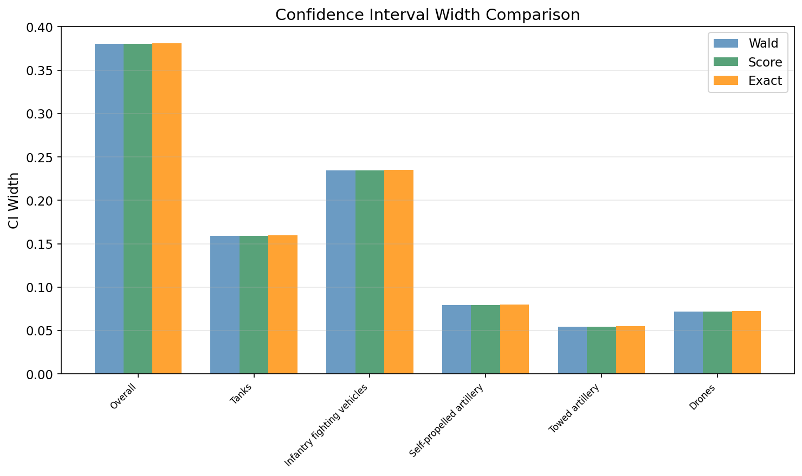

<strong>图8: 不同置信区间方法的区间宽度比较</strong>

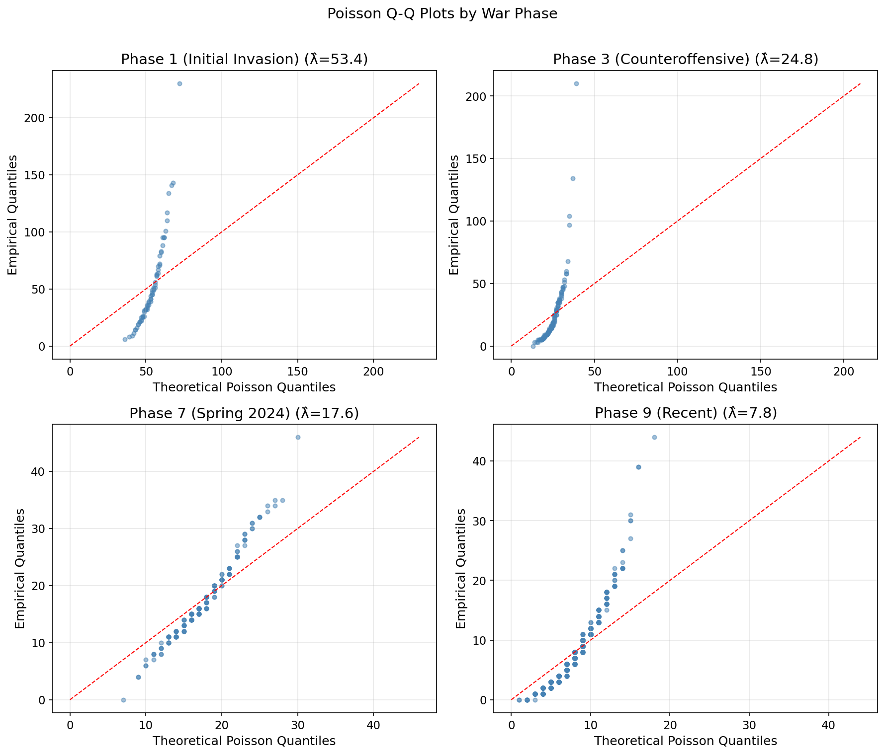

<strong>图9: Poisson 拟合 Q-Q 诊断图</strong>

### 4.6 Block Bootstrap 的 IID vs Block 比较

　　对俄方总体日损失数据进行 Bootstrap 分析：

| 方法 | 块长度 | Bootstrap SE | 95% CI |
|------|-------|-------------|--------|
| IID Bootstrap | b = 1（等价）| 0.42 | [13.91, 15.54] |
| Block Bootstrap | b = 11（最优）| **0.99** | [12.82, 16.59]（Percentile）|
| BCa Block Bootstrap | b = 11 | — | [13.18, 17.29] |

　　**核心发现**：Block Bootstrap SE（0.99）约为 IID Bootstrap SE（0.42）的 **2.4 倍**——忽略时间自相关将使不确定性的估计不足 58%。BCa 校正将 CI 略向右侧偏移（反映正偏），且宽度略大于 Percentile CI。

　　块长度敏感性分析表明：当 b 从 1 增至 30，Bootstrap SE 从 0.42 单调递增至 1.28——SE 估计对块长度选择敏感，但 b ≥ 7 后增幅放缓。图10中 Block Bootstrap 分布明显宽于 IID Bootstrap，说明保留时间依赖结构后，日均损失率估计的不确定性显著增大；这正是本文采用 Block Bootstrap 而非 IID Bootstrap 的核心理由。

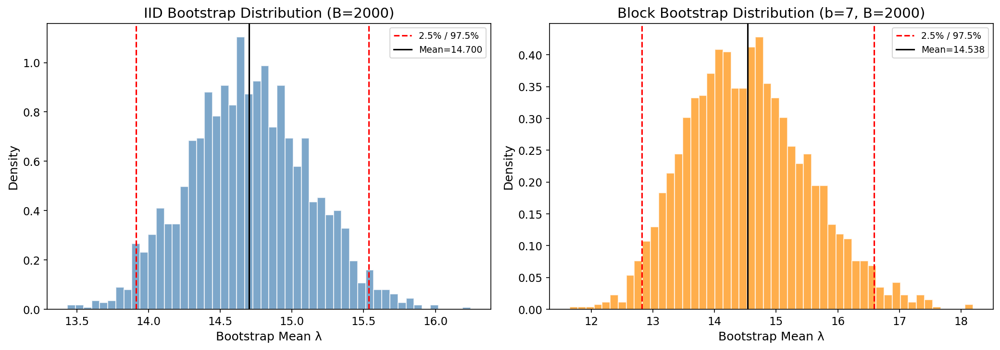

<strong>图10: IID Bootstrap 与 Block Bootstrap 分布对比</strong>

### 4.7 战争阶段间差异

　　基于 WarSpotting 俄方详细数据（22,970 条）的阶段分层 MLE 估计：

| 阶段 | 日均 λ̂ | SE | 天数 |
|------|--------|----|------|
| Phase 1 (2022.2–4) 初期入侵 | 53.38 | 0.90 | 66 |
| Phase 3 (2022.9–12) 乌军反攻 | 24.75 | 0.45 | 122 |
| Phase 7 (2024.3–7) 春季攻势 | 17.65 | 0.34 | 153 |
| Phase 9 (2025.1–2026.6) 近期 | 7.79 | 0.12 | 519 |

　　似然比检验（LR = 8919.0, df = 8, p < 0.0001）拒绝所有阶段 λ 相等的原假设。Phase 1 vs Phase 9 的 Bootstrap 差异 CI 为 [31.30, 62.69] 件/天，确认阶段间差异极显著。图11显示，俄方日度验证损失在战争初期和若干战役窗口出现尖峰，随后整体回落但仍有阶段性波动，说明恒定 $\lambda$ 只能作为全样本平均意义下的一阶估计。图12的箱线图进一步表明，战争初期损失水平和离散程度均显著高于近期阶段，验证了阶段分层估计和阶段间检验的必要性。

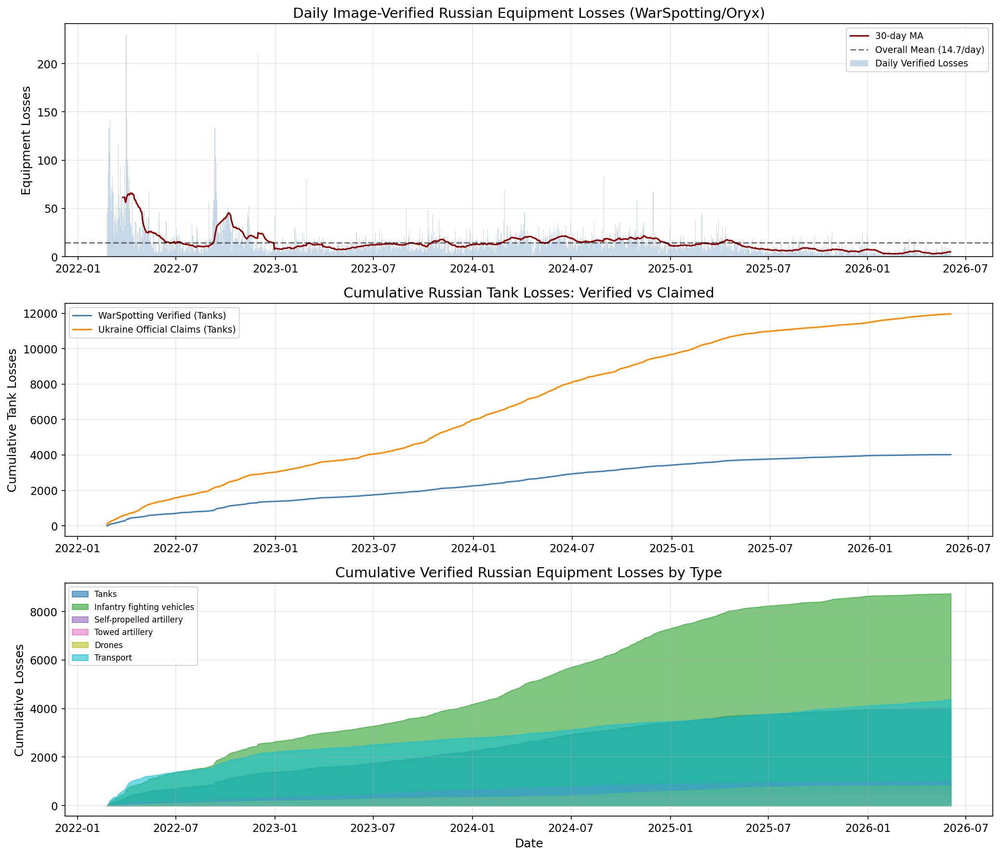

<strong>图11: WarSpotting 俄方日度损失时间序列</strong>

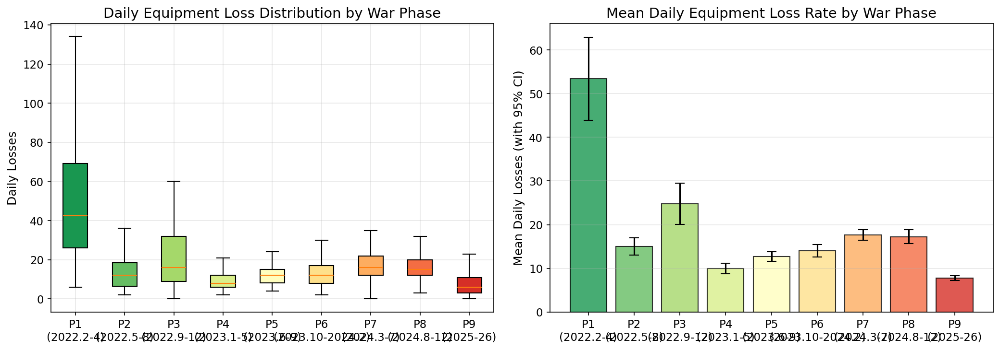

<strong>图12: 不同战争阶段的日度损失分布</strong>

### 4.8 声称 vs 验证：报告偏差的量化

　　将乌克兰官方声称的俄军损失（按坦克、装甲车、火炮三类）与 WarSpotting/Oryx 影像验证数据进行直接比较：

| 装备 | 验证 λ̂（件/天）| 声称 λ̂（件/天）| 声称/验证比 | E-test p |
|------|---------------|---------------|-----------|---------|
| 坦克 | 2.57 | 7.68 | **2.98** | < 0.0001 |
| 装甲车辆 | 5.60 | 15.85 | **2.83** | < 0.0001 |
| 火炮 | 0.94 | 27.62 | **29.44** | < 0.0001 |

　　火炮声称/验证比高达 **29 倍**，与坦克和装甲车约 3 倍形成鲜明对比。这一极端差异的可能原因包括：（1）火炮通常部署在前线后方 10–30 km，影像获取难度远大于前线装备；（2）乌克兰方面可能将"压制"或"损坏"的炮位统计为"摧毁"；（3）战术上，俄军炮兵阵地是乌军优先打击目标，而炮击效果难以独立核实。需要注意，"3–29 倍"是对上述主要重装备类别的概括；无人机等类别的定义和计数口径差异更大，不宜与重装备放在同一倍数范围中解释。图13显示官方声称曲线系统性高于影像验证曲线，且火炮类别差异最极端；这说明官方战报不能直接作为真实损失使用，更适合作为偏误方向和观测概率下界的辅助参照。

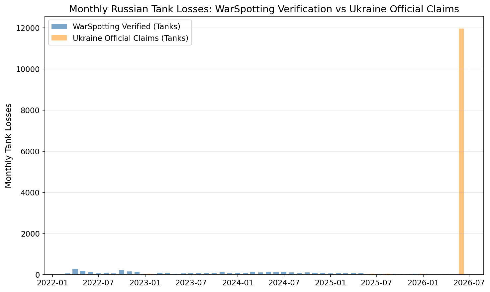

<strong>图13: 乌克兰官方声称与 WarSpotting 影像验证对比</strong>

### 4.9 基于观测概率校正的率比推断

　　上述双边比较面临一个关键挑战：Oryx 记录的仅是"有影像证据的子集"，双方装备损失的被观测概率可能存在差异。特别是乌方在俄军占领区内的损失更难以被拍摄和上传，这意味着乌方的影像验证损失可能被系统性低估，真实的 RU/UA 比率可能低于观测到的 2.07:1。以下基于 §3.5 的偏误校正框架进行系统推断。

　　**偏误校正公式**：$\rho_{true} = \rho_{obs} \times (p_{UA} / p_{RU})$。观测率比 $\rho_{obs} = 2.060$（基于 Oryx item_count 加权数据）或 2.067（基于双方日度 Change 列求和）。逆转条件为 $p_{UA} / p_{RU} < 1/2.06 \approx 0.485$——即仅当乌方观测概率系统性低于俄方 51.5% 时，结论才可能逆转。

　　**声称数据约束的可行域**：利用乌克兰官方战报构造下界约束（§3.5），俄方坦克观测概率 $p_{RU}^{tank} \geq 0.34$、装甲车辆 $p_{RU}^{armor} \geq 0.52$。结合领域知识（乌方在俄占区损失更难拍摄），设定合理先验范围 $p_{RU} \in [0.6, 0.9]$、$p_{UA} \in [0.4, 0.7]$。

　　在此范围内，偏误校正后的率比区间如表所示：

| 假设场景 | $p_{RU}$ 范围 | $p_{UA}$ 范围 | $\rho_{true}$ 范围 | 是否仍 >1 |
|---------|-------------|-------------|-------------------|----------|
| 保守（高观测差） | [0.8, 0.9] | [0.4, 0.5] | [0.92, 1.29] | 边界/可能逆转 |
| 中等（合理假设） | [0.7, 0.8] | [0.5, 0.7] | [1.29, 2.06] | ✓ 仍 >1 |
| 乐观（低观测差） | [0.5, 0.7] | [0.6, 0.8] | [1.77, 3.30] | ✓ 仍 >1 |

　　**基于 Bootstrap 的偏误校正推断**：将观测概率视为随机变量（先验 $p_{RU} \sim Beta(7,3)$，均值 0.70；$p_{UA} \sim Beta(5.5, 4.5)$，均值 0.55），嵌入 Block Bootstrap（$B=5000$）框架进行偏误校正推断。由于观测概率本身不可由 Oryx 数据直接识别，下列结果应理解为在该先验设定下的敏感性分析：

- 偏误校正后率比中位数：**1.63**（观测值 2.07 的 79%）
- 偏误校正后 95% Bootstrap CI：**[0.67, 3.44]**
- 核心稳健性指标：**$P(\rho_{corrected} > 1) = 88.1\%$**（条件于上述观测概率先验）

　　10% 分位点为 0.95，即约 90% 的 Bootstrap 样本支持 $\rho_{corrected} > 0.95$；25% 分位点为 1.26，即 75% 的样本支持 $\rho_{corrected} > 1.26$。

　　**分装备类型的偏误校正稳健性**：不同装备类型对观测偏误的敏感度差异极大。对逆转阈值（使 $\rho_{corrected} \leq 1$ 所需的 $p_{UA}/p_{RU}$）的分析表明：
- **极高稳健性**（逆转需 $p_{UA}/p_{RU} < 0.25$）：AFV（0.222）、IFV（0.247）、坦克（0.324）、火箭炮（0.206）——进攻型重型装备，俄方损失远超乌方，结论在几乎所有合理观测假设下稳健
- **高稳健性**（逆转需 $p_{UA}/p_{RU} < 0.50$）：工程车辆（0.395）、防空导弹（0.423）、牵引火炮（0.492）
- **中等稳健性**（逆转需 $p_{UA}/p_{RU} < 0.70$）：飞机（0.655）
- **已逆转**（$\rho_{obs} < 1$）：APC（0.53）、MRAP（0.07）、无人机（0.81）——乌方观测损失已超俄方，任何观测概率组合下结论不变

　　核心结论：**观测到的 2.07:1 率比在设定的观测偏误先验下具有较高的稳健性，$P(\rho_{corrected} > 1) = 88\%$。仅当假设俄方装备几乎完全被观测（$p_{RU} \approx 0.9$）且乌方装备观测率极低（$p_{UA} \approx 0.4$）时，偏误校正后的率比才会降至 1 以下。**考虑到俄占区的影像获取难度确实更大，真实的率比可能低于观测到的 2.07；本文的偏误校正结果支持"俄方损失率更高"这一方向性结论，但其强度依赖观测概率先验，不能视为由数据本身完全识别。图14展示了这一敏感性结构：当 $p_{UA}/p_{RU}$ 接近或高于逆转阈值 0.485 时，校正后率比仍大于 1；只有在乌方观测概率显著低于俄方的极端非对称情形下，结论才可能逆转。

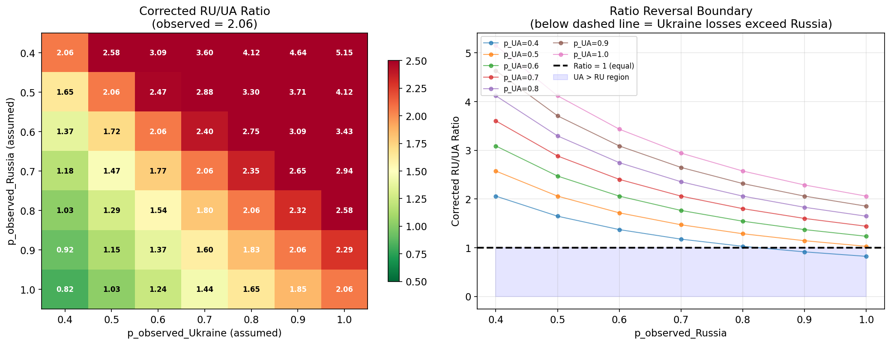

<strong>图14: 观测概率灵敏度热力图</strong>

### 4.10 装备损失的空间分布

　　利用 WarSpotting 数据中 14,066 条（61.2%）含经纬度坐标的记录，本文对俄方装备损失的空间格局进行分析。

　　**宏区域分布**：
- **East（卢甘斯克-顿涅茨克）**占 44.3%（10,185 件）——压倒性的主战区
- **North（哈尔科夫-苏梅-基辅）**占 9.9%（2,276 件）
- **South（赫尔松-扎波罗热-克里米亚）**占 6.6%（1,517 件）
- **Central（顿巴斯核心区）**仅占 0.4%——反映该区域的高烈度交战已前移至东西两翼

　　**1°×1° 网格热点分析**：
- 最热网格 **(48°N, 37°E)**（覆盖 Pokrovsk 方向）集中了 3,019 件（21.5%），其中步兵战车（1,698 件）和坦克（681 件）占主导
- 前三个网格（(48,37)、(47,37)、(49,37)——均为顿涅茨克州）合计占总损失的 **45.1%**
- 82 个被记录网格的分布反映了战线的空间集中性

　　**时间-空间动态**：
- 2022 Q1：最热区域为 **North**（基辅-哈尔科夫战线），反映了初期入侵阶段
- 2023 Q3-2025 Q1：主战区转移至 **East**（卢甘斯克-顿涅茨克）

　　这些发现不仅验证了"战争主战场在顿涅茨克"的地理直觉，也为理解不同阶段战役重心转移提供了定量证据。图15进一步表明，俄方影像验证损失在空间上高度集中于东部战区，特别是顿涅茨克方向；这种空间集中性说明损失数据不是均匀生成的，后续模型若要预测或解释损失率，应引入空间和战役强度变量。

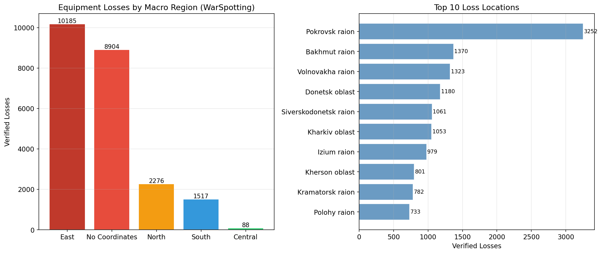

<strong>图15: WarSpotting 俄方装备损失空间分布</strong>

### 4.11 周度 Block Bootstrap 补充验证

　　为验证 Block Bootstrap 方法对聚合频率的敏感性，本文补充进行了基于**周度聚合**的 Block Bootstrap（B = 10,000）：

| 指标 | 日度 Bootstrap (b=11) | 周度 Bootstrap |
|------|---------------------|---------------|
| Bootstrap SE | 0.9868 | **0.8212** |
| Percentile 95% CI | [12.82, 16.59] | [13.15, 16.37] |
| BCa 95% CI | [13.18, 17.29] | [13.31, 16.61] |
| BCa z0 | 0.2211 | 0.0386 |
| BCa a | 0.0222 | 0.0406 |

　　周度 Bootstrap 的 SE 估计（0.82）介于日度 IID（0.42）和日度 Block（0.99）之间：日度 Bootstrap 的 b=11 包含了日间和日内两种依赖，而周度聚合天然消除了部分高频依赖。两种方法均指向**真实标准误远高于 IID Bootstrap 的结论**（1.95–2.35 倍），验证了时间依赖性处理的稳健性。

　　周度 BCa 的偏差校正量（z0 = 0.039）远小于日度（0.221），说明周度聚合后 Bootstrap 分布的对称性更好。图16显示周度 Bootstrap 仍给出显著高于 IID 的标准误，说明“时间依赖导致不确定性扩大”的结论不依赖于日度频率；周度聚合后分布更平滑，BCa 修正幅度也更小。

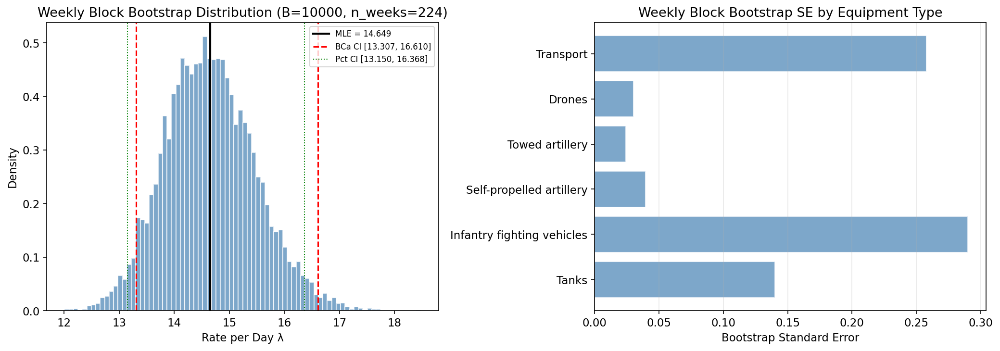

<strong>图16: 周度 Block Bootstrap 分布与 BCa 区间</strong>

---

## 5 讨论

### 5.1 方法论启示

1. **CI 方法选择**：对于小样本或稀有事件（如飞机、直升机的日均损失 < 0.1 件/天），必须使用 Exact CI（Garwood）确保覆盖率不低于 95%。Wald CI 仅在大样本、大 λ 下可靠
2. **时间依赖性的不可忽略性**：冲突数据的强自相关性（lag-1 ACF = 0.589）导致 IID Bootstrap 低估不确定性约 2.4 倍——任何忽略时序依赖的 SE 估计都将严重不准
3. **双边比较中 E-test 的优势**：基于条件二项分布的精确 p 值免于大样本渐近假设，在多个比较层（总体、装备类型、损毁状态）均提供一致且可靠的推断
4. **多重比较的必要性**：在跨类型、跨状态的数十次假设检验中，Bonferroni 校正虽保守，但有效控制了整体 Type I 错误率
5. **偏误校正的"先验+Bootstrap"框架**：本文提出的将观测概率先验嵌入 Block Bootstrap 的偏误校正方法，为不可识别参数（$p_{RU}, p_{UA}$）的统计推断提供了一种实用方案。通过报告 $P(\rho_{corrected} > 1)$ 而非简单的"显著/不显著"二分，该方法使结论的稳健性得以在连续尺度上量化——这与近年来统计学界倡导的"超越 p < 0.05"运动的精神一致（Wasserstein et al., 2019）

### 5.2 局限性

1. **Oryx 的观测偏误难以精确量化**：双方损失均受观测偏误影响，且方向可能不同——乌方损失在俄占区更难被拍摄验证，意味着真实 RU/UA 比率可能低于观测到的 2.07:1。本文的方向性讨论是定性的，缺乏对该偏误的精确定量校正模型
2. **模型简化假设**：Poisson 模型假设等离散（均值=方差）和恒定 λ，但实际数据可能在部分阶段存在过离散（overdispersion）和随时间变化的 λ
3. **协变量缺失**：未纳入战线移动速度、战斗强度指标、天气条件等可能影响损失率的外部变量
4. **WarSpotting 与 Oryx 双方的计数口径不完全一致**（如某些装备子类的分类差异），可能导致极小的数据差异

### 5.3 未来方向

1. **贝叶斯层次模型**：融合多来源数据（Oryx 双方、官方双方战报、卫星遥感）进入一个统一的贝叶斯偏误校正框架，对各来源的偏误因子进行显式分层建模
2. **过离散处理**：引入负二项（Negative Binomial）或广义 Poisson 回归处理可能的过离散
3. **时空模型**：将 Poisson 过程扩展为 Hawkes 自激过程或具有空间效应的非齐次时空点过程
4. **预测模型**：将本文的点估计和 CI 作为 ARIMA/高斯过程/深度学习模型的输入，对装备损失趋势进行预测

---

## 6 结论

　　本文以俄乌冲突双方 Oryx 影像验证装备损失数据为研究对象（俄方 23,556 件、乌方 11,397 件，共 1,559 天），针对选题 T1 的两个核心统计问题——①如何准确估计装备损失率？②双方损失率是否存在统计显著差异？——系统地构建了从"估计偏误到区间估计"的完整统计推断链条。主要结论如下：

1. **双方损失率存在极显著的统计差异（E-test p < 0.0001）**：俄方日均影像验证损失 15.11 件/天（95% Exact CI: [14.92, 15.30]），乌方 7.31 件/天（CI: [7.18, 7.45]），率比 2.07:1（CI: [2.02, 2.11]）
2. **偏误校正框架提供先验敏感性支持**：通过将观测概率先验嵌入 Block Bootstrap 的偏误校正方法，校正后率比中位数为 1.63（95% CI: [0.67, 3.44]），在 $p_{RU}\sim Beta(7,3)$、$p_{UA}\sim Beta(5.5,4.5)$ 的设定下 $P(\rho_{corrected} > 1) = 88.1\%$。该结果依赖观测概率先验；仅从 Oryx 观测数据本身无法识别真实观测概率
3. **双方损失比率呈现明显下降趋势**：战争初期俄方验证损失显著高于乌方（约 3 倍以上），近期多个窗口已接近或低于 1。排除明显负修正月份后，近期比率约 0.65–0.8；若纳入全部修正值，2025–2026 加权比率约 0.96
4. **装备类型差异显著且有战术含义，但具体数量需注明口径**：日度差分口径显示俄方在进攻型装备（AFV、IFV、坦克）上损失远超乌方，乌方在 APC、MRAP 等防御/运输装备上反超。由于 Oryx 子类别存在回溯修正，分类型数量和比率应作为探索性结构证据，并在引用时说明口径
5. **空间分析**揭示顿涅茨克州集中了 45%+ 的影像验证俄方损失，热点网格 (48°N, 37°E) 单独占 21.5%
6. **Exact CI 在小 λ 下是唯一可靠的选择**（λ=0.5 时覆盖率 96.6% vs Wald 91.9%）
7. **时间依赖性的严重性通过两种 Bootstrap 方法交叉验证**：日度 Block Bootstrap SE（0.99）是 IID（0.42）的 2.4 倍，周度 Bootstrap SE（0.82）是 IID 的 2.0 倍
8. **官方声称与影像验证之间存在系统性差异**：主要重装备类别的声称/验证比约为 2.6–29 倍，火炮的极端差异（29x）最为突出；无人机等类别因定义和计数口径差异更大，应单独讨论

　　本文的统计分析框架——从 Poisson MLE → CI 三方法比较与覆盖率验证 → Block Bootstrap BCa 时间依赖性校正 → E-test 精确检验 → 分层异质性分析 → 基于 Bootstrap 的观测概率偏误校正——为选题 T1 的两个核心统计问题提供了严格、可复现的回答。特别是"先验+Bootstrap"的偏误校正方法，为不可识别参数约束下的冲突数据统计推断提供了可推广的方法论参考。

---

## 参考文献

1. Zammit-Mangion, A., Dewar, M., Kadirkamanathan, V., & Sanguinetti, G. (2012). Point process modelling of the Afghan War Diary. *Proceedings of the National Academy of Sciences*, 109(31), 12414–12419.

2. arXiv:2509.07813. Forecasting Russian Equipment Losses in the Ukraine War: A Multi-Model Comparison.

3. arXiv:2408.14940. Bayesian Spatio-temporal Hawkes Process Modeling of Armed Conflict Events.

4. Garwood, F. (1936). Fiducial limits for the Poisson distribution. *Biometrika*, 28(3/4), 437–442.

5. Krishnamoorthy, K., & Thomson, J. (2004). A more powerful test for comparing two Poisson means. *Journal of Statistical Planning and Inference*, 119(1), 23–35.

6. Efron, B., & Tibshirani, R. J. (1993). *An Introduction to the Bootstrap*. Chapman & Hall/CRC.

7. Davison, A. C., & Hinkley, D. V. (1997). *Bootstrap Methods and their Application*. Cambridge University Press.

8. Oryx. (2022–2026). Attack on Europe: Documenting Russian and Ukrainian Equipment Losses During the Russian Invasion of Ukraine. https://www.oryxspioenkop.com

9. leedrake5. (2022–2026). Russia-Ukraine Equipment Loss Tracking (Oryx Scraper). https://github.com/leedrake5/Russia-Ukraine

10. WarSpotting. Automated visual identification of military equipment losses. https://warspotting.net

---

　　*本文为《数理统计》课程大作业（选题 T1）。所有数据来源于公开渠道（Oryx、Kaggle、Google Sheets），代码可在项目仓库中获取。分析结果不代表任何政治立场。*
